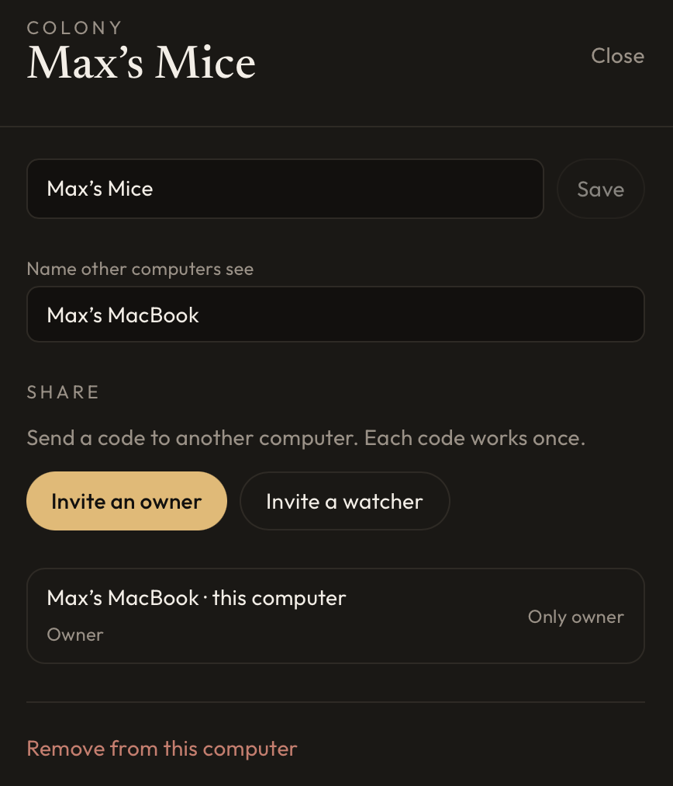

# MouseWeightLogger

<p align="center">
  
</p>

Daily mouse weigh-ins, a colony roster, and weight curves. Local on your computer, offline-first. Share a colony with another machine when you want to.

## Screenshots

**Today** — weigh-in cards with sex, age, last weight, and % of baseline.


**Mice** — roster by cohort, CSV export, photos and metadata.


**Curves** — pan, zoom, baseline line, PNG export.


**Colonies** — header pills. **+** creates or joins; the pencil edits, shares, or removes.

<p>
  
  
</p>

## Run

You need [Node.js](https://nodejs.org/) and [Rust](https://rustup.rs/).

```bash
npm install
npm run tauri dev
```

Build an installer: `npm run tauri build`

## How it works

### On this computer

Each install keeps its own SQLite database and photo folder under the OS app-data path (macOS: `~/Library/Application Support/com.maxchalabi.mouseweightlogger/`). Everything works offline. Weigh-ins, roster edits, and curve settings stay on disk until you share.

### Colonies

A **colony** is one log: its mice, weights, settings, and photos. The header pill selects which colony Today, Mice, and Curves show. You can keep several colonies on one machine; they do not mix data.

The first launch creates **This computer** as a private colony. **+** adds another local colony or joins an existing one with an invite code.

### Sharing

Sharing is built in. An owner opens the pencil drawer and taps **Invite an owner** or **Invite a watcher**. The app shows a one-time code; the other computer types it in **+ → Join colony**. No accounts, no setup screen.

| Role | Can do |
| --- | --- |
| Owner | Edit mice and weights, invite, rename the colony, remove devices |
| Watcher | View Today, Mice, Curves; export CSV |

Codes expire after 7 days and work once.

**Remove from this computer** drops the colony from this machine only, unless you are the last computer that still has it—in that case the shared colony is deleted everywhere. The confirmation says which applies.

While offline, owner edits queue locally and upload on the next sync. If two owners change the same mouse or the same day’s weight, the later edit wins.

### Sync backend

Shared colonies sync through a hosted [Supabase](https://supabase.com/) project baked into the app (`src/lib/sync-config.ts`). The anon key ships in the client; row-level security limits each device to colonies it belongs to. Edge Functions hold the service role and handle device identity, colony creation, invites, and membership.

Rough flow:

1. **Device session** — first share or join registers this computer as a device user (no email login in the UI).
2. **Share** — uploads the local colony (mice, weights, settings, photos) and returns invite codes.
3. **Join** — redeems a code and pulls the colony down into local SQLite.
4. **Sync loop** — owners push dirty rows and pull remote changes; watchers pull only. Photos use object storage keyed by `{colony_id}/{mouse_id}`.

Local schema lives in `src-tauri/migrations/` and `src/lib/db.ts`. Server schema and functions are under `supabase/`. Soft deletes (`deleted_at`) and `updated_at` timestamps drive merge; the active colony syncs on a timer, on window focus, and on realtime notifications.

When the last member leaves, `set-member` deletes the colony row, related data, and stored photos on the server.

## Stack

Tauri 2, React, TypeScript, Tailwind, SQLite (`tauri-plugin-sql`), Plotly, Supabase.

## License

[MIT](LICENSE)
