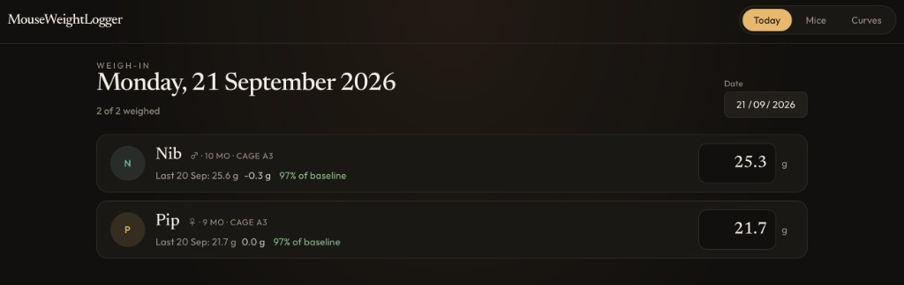
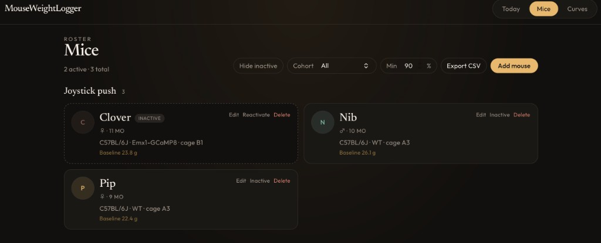
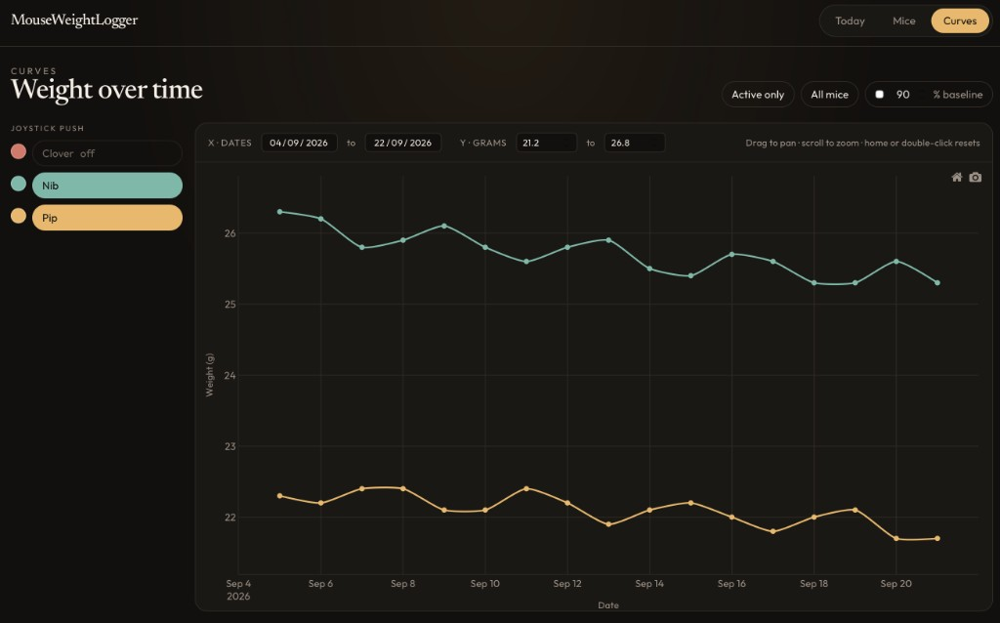

# MouseWeightLogger

<p align="center">
  
</p>

Local desktop app for daily mouse weigh-ins, colony metadata, and interactive weight curves. Runs on macOS, Windows, and Linux. Everything stays on this computer — SQLite, no account, no cloud.

## What it does

- **Today** — weigh active mice for the day. Cards show ♀ / ♂, age, last weight, and % of a configurable baseline.
- **Mice** — roster grouped by experiment / cohort. Add, edit, inactivate, or delete. Each mouse gets a unique plot color; photos and extra fields (strain, genotype, cage, ear mark, notes) are optional. One CSV export includes mice and daily weights.
- **Curves** — interactive Plotly viewer. Pick mice or a whole cohort, drag to pan, scroll to zoom, home / double-click to reset. Save a PNG with the legend.

## Screenshots

**Today**



**Mice**



**Curves**



## Run

You need [Node.js](https://nodejs.org/) and [Rust](https://rustup.rs/).

```bash
npm install
npm run tauri dev
```

## Build a desktop installer

```bash
npm run tauri build
```

## Data

The database and imported photos live in the OS app-data directory, not in this repo:

| OS | Path |
| --- | --- |
| macOS | `~/Library/Application Support/com.maxchalabi.mouseweightlogger/` |
| Windows | `%APPDATA%\com.maxchalabi.mouseweightlogger\` |
| Linux | `~/.local/share/com.maxchalabi.mouseweightlogger/` |

## Stack

Tauri 2, React, TypeScript, Tailwind, SQLite (`tauri-plugin-sql`), Plotly.

## License

[MIT](LICENSE)
